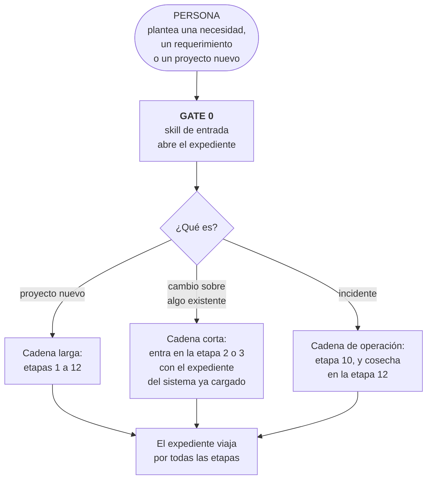
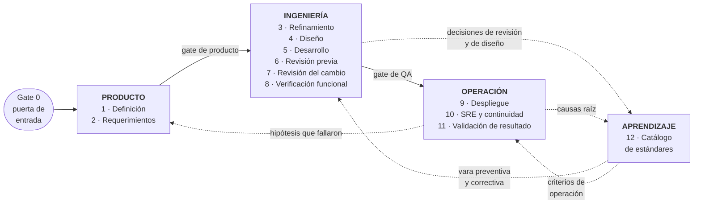
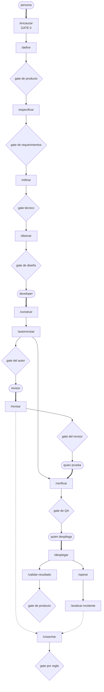
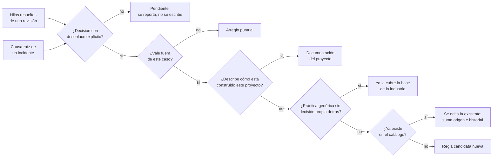

# CAUCE

### Ciclo Asistido Unificado de Construcción y Entrega

**SDLC Framework con asistencia de IA.** Un marco de ciclo de vida de desarrollo de software
—*Software Development Life Cycle*— que define las etapas, sus entradas y salidas, los puntos
de control humano y los actores de cada una.

Documento técnico de referencia, agnóstico de empresa, dominio, lenguaje y plataforma.

Cubre el recorrido completo: desde que una persona plantea una necesidad hasta que el sistema
opera en producción, con la organización habiendo aprendido algo de haberlo hecho.

Una crecida y un río tienen la misma agua. La diferencia es el cauce.

[TOC]

---

## 1. La tesis

La mayoría de los equipos ya usa asistentes de IA. Casi siempre de la misma forma: cada
persona con su propio prompt, en su propia ventana, sin dejar rastro. El resultado se nota a
los pocos meses.

La calidad depende de quién usó el asistente ese día y de qué tan bien lo pidió. Las
decisiones se evaporan, y el mismo debate vuelve tres semanas después en otro cambio. La
seguridad y el cumplimiento entran cuando el código ya está escrito, que es el momento más
caro. Y nada es auditable: no hay forma de responder qué vara se aplicó a un cambio, quién la
aprobó, ni desde cuándo rige.

CAUCE no agrega capacidades nuevas al asistente. Ordena las que ya existen en etapas con
entrada, salida y responsable, con puntos explícitos donde decide una persona, y con
mecanismos que convierten cada decisión y cada incidente en una vara reutilizable.

La ganancia no viene de que el asistente haga más. Viene de que lo que hace quede, se
encadene, y no dependa de que alguien se acuerde.

### Qué tipo de marco es, y qué no reemplaza

CAUCE es un **SDLC**: describe el ciclo de vida del producto de software, desde la necesidad
hasta el retiro, con las etapas, los artefactos y los controles de cada tramo. Se ubica en la
misma familia que los SDLC clásicos —cascada, iterativos, en V— y que las prácticas de
integración y entrega continua.

Lo que lo distingue de ellos es que **la asistencia de IA está en el diseño del ciclo y no
encima de él**. En los marcos existentes la IA se agrega como herramienta que cada persona usa
a discreción. Acá cada etapa declara qué produce la máquina, qué decide la persona y qué queda
escrito para la siguiente.

**No reemplaza la forma de organizar al equipo.** Scrum, Kanban o lo que la organización use
para priorizar, planificar y coordinar sigue funcionando igual encima de CAUCE. Este marco no
define ceremonias, ni cadencia, ni estimación, ni cómo se arma el backlog. Define el recorrido
de un trabajo y quién habilita cada paso.

**Tampoco reemplaza las prácticas de ingeniería** que el equipo ya tenga. Integración
continua, pruebas automatizadas, infraestructura como código y despliegue progresivo son
insumos de las etapas 5 a 9, no alternativas a ellas.

---

## 2. Gate 0: la puerta de entrada

CAUCE tiene **una sola entrada**. Una persona plantea una necesidad, un requerimiento o un
proyecto nuevo, y desde ahí se encadena todo lo demás.

Lo que la persona entrega en Gate 0 puede ser tan informal como una nota de voz transcrita o
un correo reenviado. Lo que **no** puede faltar es quién lo pide y para qué. Todo lo demás lo
levanta la primera etapa preguntando.

### El expediente

De Gate 0 sale un **expediente**: un artefacto único que acompaña al trabajo por todo el ciclo
y va acumulando lo que cada etapa produce. Es lo que permite que las etapas se encadenen sin
que nadie vuelva a tipear el contexto.

| Etapa que lo escribe | Qué agrega al expediente |
|---|---|
| 0 · Entrada | Quién pide, para qué, y de qué tipo es el trabajo |
| 1 · Definición | Problema, contexto, restricciones, clasificación de datos |
| 2 · Requerimientos | Criterios de aceptación funcionales y no funcionales, requisitos de cumplimiento |
| 3 · Refinamiento | Componentes afectados, riesgos con dueño, plan de pruebas y de observabilidad |
| 4 · Diseño | Decisión de arquitectura, alternativas descartadas y por qué |
| 5 · Desarrollo | Cambios propuestos, instrumentación, pruebas |
| 6 · Revisión previa | Hallazgos resueltos, guion de verificación funcional |
| 7 · Revisión del cambio | Hilos, decisiones, hallazgos publicados |
| 8 · Verificación | Resultado por criterio |
| 9 · Despliegue | Verificación posterior contra los criterios de la etapa 2 |
| 10 · Operación | Incidentes, causas raíz, resultado de ensayos de continuidad |
| 11 · Validación | Resultado contrastado contra el problema de la etapa 1 |
| 12 · Aprendizaje | Reglas cosechadas, descartes con motivo, pendientes |

El expediente es también el registro de auditoría. Responde qué se pidió, qué vara se aplicó,
quién aprobó cada paso y con qué evidencia.

### Qué se encadena solo y qué no

La cadena avanza sola entre etapas. **Se detiene en cada gate humano**, sin excepción.

Un ciclo que corre de punta a punta sin intervención no es este framework: es una fábrica de
código sin dueño. Los gates son el producto, no el obstáculo.

---

## 3. Principios

Aplican a todas las etapas. Una implementación que rompe uno deja de ser CAUCE.

**El asistente prepara, la persona decide.** El asistente hace el trabajo pesado: leer,
correlacionar, redactar, verificar. Cada decisión con consecuencias es de una persona, y se
toma sobre algo ya redactado.

**Nada se ejecuta desatendido hacia sistemas compartidos.** Publicar un comentario, abrir un
cambio, escribir en un ticket, tocar un ambiente, silenciar una alerta. Todo se muestra
primero y se ejecuta con aprobación explícita, una por una. Aprobar una cosa no autoriza las
otras.

**Verificar antes de afirmar.** Ninguna afirmación sobre cómo funciona el sistema se sostiene
en la memoria del asistente ni en documentación que puede estar vieja. Se comprueba contra el
código, los datos o el ambiente. Si no se pudo comprobar, se dice.

**Toda regla muestra de dónde salió.** Una norma sin enlace a la discusión o al incidente que
la originó es la opinión de alguien con formato de norma.

**Los descartes se registran.** Cuando alguien rechaza un hallazgo, el motivo queda escrito.
Sin eso el asistente vuelve a levantarlo y el equipo aprende a ignorarlo, incluidos los
hallazgos que sí importaban.

**Las dependencias que faltan se nombran.** Si falta un acceso, un token o una fuente de
datos, se dice cuál y se sigue con lo que sí se puede, marcando qué quedó sin cubrir.

**Comprobar antes de crear.** Antes de abrir un ticket, un cambio o un comentario, se verifica
si ya existe. Si existe, se actualiza. Nunca un duplicado.

**Toda etapa entrega un artefacto verificable.** Una etapa cuya salida es "quedamos de
acuerdo" no ocurrió.

**El expediente es la única fuente de contexto.** Lo que no está en el expediente no existe
para la etapa siguiente. Eso obliga a que el contexto quede escrito y no en la cabeza de
quien estuvo en la reunión.

---

## 4. El ciclo completo

Las flechas punteadas son el ciclo de aprendizaje. Una decisión tomada hoy en una revisión, o
una causa raíz encontrada hoy en un incidente, se convierte en una vara que mañana se aplica
sola, antes de escribir código.

Que el catálogo entre también en el refinamiento es lo que hace que el estándar deje de ser
solo correctivo. Un requerimiento que choca con una regla vigente se detecta antes de la
primera línea.

---

## 5. Las skills, nombradas

Catorce skills, todas en español. Los nombres son la propuesta de CAUCE; lo que no es
negociable es el contrato de cada una: quién la gatilla, qué recibe, qué entrega, y dónde se
detiene a preguntar.

Las flechas gruesas salen de una persona: son los **cinco momentos de invocación humana**.
Las delgadas las encadena el framework. Las punteadas alimentan el aprendizaje. Los rombos
detienen la cadena hasta que alguien decide.

### El contrato de cada skill

| Skill | Etapa | La gatilla | Entrega | Escribe fuera, con aprobación |
|---|---|---|---|---|
| `/encauzar` | 0 | **Persona** | Expediente abierto y clasificado por tipo de trabajo | Ticket |
| `/definir` | 1 | `/encauzar` | Problema, contexto, clasificación de datos | Ticket |
| `/especificar` | 2 | `/definir` | Criterios de aceptación y de cumplimiento | Ticket |
| `/refinar` | 3 | `/especificar` | Componentes, riesgos con dueño, plan de pruebas y observabilidad | Subtareas |
| `/disenar` | 4 | `/refinar` | Alternativas contrastadas y decisión registrada | Registro de decisión |
| `/construir` | 5 | **Persona** | Cambio implementado, instrumentado y con pruebas | Repositorios |
| `/autorrevisar` | 6 | `/construir` | Hallazgos privados, propuesta de cambio, guion de QA | Cambio y guion |
| `/revisar` | 7 | **Persona**, varias veces | Respuestas a hilos y hallazgos propios | Comentarios, uno por uno |
| `/verificar` | 8 | **Persona**, con el guion de `/autorrevisar` | Resultado por criterio | Nada |
| `/desplegar` | 9 | **Persona** | Verificación posterior contra los criterios | Producción |
| `/operar` | 10 | Alerta o persona | Diagnóstico sostenido en fuentes | Alertas e incidentes |
| `/analizar-incidente` | 10 | Cierre de incidente | Línea de tiempo y causa raíz | Documento |
| `/validar-resultado` | 11 | `/desplegar`, tras el plazo fijado en la etapa 2 | Contraste contra el problema original | Ticket |
| `/cosechar` | 12 | `/revisar` y `/analizar-incidente` | Reglas candidatas y tres listas | Catálogo, regla por regla |

Cada skill declara explícitamente **qué no hace**. Un asistente sin límites escritos los
inventa sobre la marcha, y los inventa distinto cada vez.

### Los cinco momentos de invocación humana

La cadena la empiezan personas en cinco puntos, y solo cinco: cuando nace la necesidad
(`/encauzar`), cuando alguien se sienta a construir (`/construir`), cuando alguien revisa
(`/revisar`), cuando alguien prueba (`/verificar`) y cuando alguien despliega (`/desplegar`).
Todo lo demás lo encadena el framework.

Eso importa porque **los mecanismos que dependen de que una persona recuerde invocarlos no
ocurren**. El síntoma clásico es un catálogo de estándares vacío junto a cambios con cientos
de comentarios de discusión: nadie se acordó de cosechar. Por eso `/cosechar` la gatilla
`/revisar` en cada pasada, y no una persona.

### Skills transversales

Dos capacidades no pertenecen a una etapa y las consultan varias:

| Skill | Para qué | La consultan |
|---|---|---|
| `/consultar-catalogo` | Traer las reglas vigentes que aplican por ámbito y proyecto | `/refinar`, `/disenar`, `/autorrevisar`, `/revisar` |
| `/registrar-falso-positivo` | Dejar por escrito un hallazgo que el equipo rechazó, y el motivo | `/autorrevisar`, `/revisar` |

## 6. Los actores

### La línea que separa a la IA de las personas

Todo el framework se apoya en una división que no admite excepciones.

**La IA produce y verifica. La persona juzga y autoriza.**

Cuatro cosas hace siempre la IA, en todas las etapas:

1. Leer y correlacionar todo lo que haga falta, sin cansarse ni saltarse partes.
2. Redactar el borrador de cada artefacto, para que nadie parta de una hoja en blanco.
3. Comprobar contra la fuente en vez de contra su memoria, y decir cuando no pudo comprobar.
4. Encadenar la etapa siguiente arrastrando el expediente, para que el contexto no se retipee.

Cuatro cosas hace siempre una persona, y la IA nunca:

1. **Aceptar o rechazar en un gate.**
2. **Elegir entre alternativas cuando hay que renunciar a algo.** Un compromiso entre costo,
   plazo y alcance es una decisión de negocio, no un cálculo.
3. **Autorizar cualquier escritura hacia un sistema compartido.**
4. **Responder por el resultado.** La responsabilidad no se delega a una herramienta, y una
   organización que lo intente descubre el problema en la primera auditoría.

Cuando una de las cuatro de la derecha se corre a la izquierda, el framework deja de aplicar,
aunque todo lo demás siga igual.

### Los ocho roles

Roles, no cargos. Una persona puede tener varios.

| Rol | Qué habilita | Perfil |
|---|---|---|
| **Solicitante** | Nada. Es quien plantea la necesidad | Conoce el problema de primera mano. No necesita perfil técnico |
| **Responsable de producto** | Gates 1, 2 y 11 | Decide qué se construye y qué no. Tolera que le digan que su hipótesis falló |
| **Responsable técnico** | Gates 3 y 4 | Criterio de arquitectura y memoria del sistema. Capaz de rechazar una propuesta bien redactada |
| **Constructor** | Gate 6, sobre su propio trabajo | Implementa. Sabe leer lo que la IA propone y detectar cuando está mal |
| **Revisor** | Gate 7 | Persona distinta del constructor. Ejerce criterio, no relee lo que la IA ya dijo |
| **Verificador** | Gate 8 | Prueba contra los criterios. Puede ser otro constructor del equipo |
| **Responsable de operación** | Gate 9 y las acciones sobre producción | Sostiene el servicio. Decide revertir |
| **Custodio del estándar** | Gate 12 | Aprueba reglas. En las reglas duras, el equipo completo |

### Las tres incompatibilidades

Un mismo nombre puede ocupar varios roles, salvo en tres casos. Estas son las que sostienen la
independencia de criterio cuando el equipo es chico.

**Quien construye no revisa ese mismo cambio.** Es la separación que evita que el asistente
termine siendo el único revisor.

**Quien propone una decisión de diseño no la acepta.** Una alternativa única presentada sin
contraste, aprobada por quien la escribió, es una decisión que nadie tomó.

**Quien construye no valida el resultado de negocio.** Nadie es buen juez de si su propio
trabajo sirvió.

### Quién participa en cada etapa

| Etapa | La IA hace | La persona hace | Quién |
|---|---|---|---|
| 0 · Entrada | Clasifica el tipo de trabajo y abre el expediente | Plantea la necesidad | Solicitante |
| 1 · Definición | Redacta el problema, marca ambigüedad, clasifica datos | Acepta el enunciado | Producto |
| 2 · Requerimientos | Propone criterios y exige número en los no funcionales | Acepta los criterios | Producto y técnico |
| 3 · Refinamiento | Mapea componentes leyendo el código, levanta riesgos | Asigna dueño a cada riesgo y acepta el desglose | Técnico |
| 4 · Diseño | Plantea alternativas contrastadas y sus consecuencias | Elige una y responde por ella | Técnico, distinto de quien construirá |
| 5 · Desarrollo | Implementa, instrumenta, escribe pruebas | Dirige y corrige | Constructor |
| 6 · Revisión previa | Revisa en privado, redacta la propuesta y el guion de QA | Aprueba cada publicación | Constructor |
| 7 · Revisión del cambio | Responde hilos, levanta hallazgos, cosecha | Confirma cada hallazgo antes de publicarlo | Revisor |
| 8 · Verificación | Redacta el guion | Ejecuta y marca resultado | Verificador |
| 9 · Despliegue | Compara con los criterios, propone revertir | Autoriza cada acción sobre producción | Operación |
| 10 · Operación | Diagnostica con evidencia, redacta el postmortem | Decide qué se toca y qué se alerta | Operación |
| 11 · Validación | Contrasta el resultado contra el problema original | Decide cerrar, iterar o revertir | Producto |
| 12 · Aprendizaje | Redacta la regla candidata con su origen | Confirma que es una decisión del equipo | Custodio |

### Cuántas personas

Trece etapas y ocho roles no significan trece personas. Los roles se concentran, y las tres
incompatibilidades son las que fijan el piso.

**Mínimo viable: tres personas.** Una en producto, y dos técnicas que se alternan: cuando una
construye, la otra revisa, y al revés. Con eso se cumplen las tres incompatibilidades. La
operación la sostiene cualquiera de las dos técnicas.

**Recomendado: cuatro o cinco.** Se agrega una persona dedicada a operación, que es el rol que
peor se sostiene a tiempo parcial porque los incidentes no esperan. Y conviene separar al
solicitante de producto, para que quien pide no sea quien aprueba.

**Techo práctico: siete.** Por encima de eso los gates empiezan a hacer cola y el ciclo se
frena esperando aprobaciones. Cuando un producto necesita más gente, conviene partirlo en dos
ciclos con expedientes separados antes que engordar uno solo.

Un ciclo tradicional que cubra el mismo alcance suele repartir estos ocho roles entre ocho o
diez personas, con transferencia de contexto en cada traspaso. La reducción no viene de que
alguien trabaje más: viene de que el contexto viaja en el expediente en vez de reconstruirse
en cada reunión de traspaso.

### Un aviso sobre el equipo chico

Menos personas significa menos puntos de vista independientes. Un equipo reducido con
asistencia fuerte converge rápido, y puede converger con mucha seguridad hacia una solución
equivocada, porque el asistente redacta con la misma solvencia lo correcto y lo incorrecto.

Las tres incompatibilidades existen justamente para eso. Un equipo que recorta gente y además
las relaja no está aplicando CAUCE: está automatizando su propio sesgo, más rápido que antes.

---

## 7. Las etapas

### Etapa 1 · Definición

Convierte una necesidad en lenguaje de negocio en un enunciado que un equipo técnico pueda
evaluar. La ejecuta producto.

El asistente redacta el enunciado desde notas, entrevistas o tickets de soporte, separando el
problema observado de la solución que alguien ya imaginó: la mayoría de los requerimientos
llegan con una solución adentro y sin el problema que la motivó. Marca la ambigüedad en vez de
resolverla, devolviendo las dos lecturas posibles. Clasifica los datos en juego —personales,
de salud, financieros, regulados— y esa clasificación acompaña al expediente hasta producción,
determinando la profundidad de todas las etapas siguientes. Y busca antecedentes: tickets
anteriores sobre lo mismo, decisiones ya tomadas, incidentes relacionados, reglas del catálogo
que apliquen.

**Gate.** Producto aprueba. Nada avanza sin clasificación de datos.

### Etapa 2 · Requerimientos

Fija qué significa que esto esté terminado, en términos comprobables.

El asistente propone criterios de aceptación verificables, y obliga a que los no funcionales
lleven número: tiempo de respuesta, volumen esperado, disponibilidad exigida, ventana de
recuperación tolerable. Sin número no se pueden verificar en la etapa 8 ni vigilar en la 10.
Deriva de la clasificación de datos los requisitos de cumplimiento que aplican: retención,
auditoría, cifrado, minimización, derechos del titular. Y señala qué criterios van a necesitar
instrumentación, para que la etapa 3 los considere.

**Gate.** Un criterio no funcional sin número se devuelve.

### Etapa 3 · Refinamiento

Convierte los requerimientos en trabajo ejecutable, con los riesgos sobre la mesa antes de
escribir código.

El asistente descompone en tareas con salida verificable, y mapea qué componentes toca
**leyendo el código real**: un mapa hecho de memoria o de un diagrama viejo se equivoca justo
en los sistemas que más han cambiado. Levanta los riesgos de seguridad y cumplimiento apoyado
en la clasificación de datos y en las reglas duras vigentes. Detecta cuando el requerimiento
choca con una regla vigente y lo plantea como decisión de producto. Propone el plan de pruebas
y el **plan de observabilidad**: lo que no se instrumenta acá no existe en la etapa 10.

**Gate.** Un riesgo sin dueño asignado bloquea el paso a desarrollo.

### Etapa 4 · Diseño

Fijar la decisión de arquitectura antes de escribir código, y dejarla registrada.

Es la etapa donde la asistencia más rinde y más riesgo trae: el asistente propone una
solución con la misma solvencia esté bien o mal fundada. Por eso se registra la decisión y no
solo el resultado.

El asistente plantea **al menos dos alternativas viables** con sus consecuencias, en vez de
presentar una sola como si fuera la única. Nombra lo que cada alternativa cierra hacia el
futuro, que suele pesar más que su costo de hoy. Cruza cada alternativa contra las reglas
vigentes del catálogo y contra los patrones que el proyecto ya sostiene. Y redacta la decisión
en un registro corto: qué se decidió, qué alternativas se descartaron y por qué, y qué haría
falta para revisarla más adelante.

**Gate.** Alguien que no redactó la propuesta acepta la decisión. Una alternativa única
presentada sin contraste se devuelve.

**Salida.** Registro de decisión de arquitectura, incorporado al expediente.

Este registro es una de las mejores fuentes de la etapa 12: una decisión de diseño ya viene
argumentada y contrastada, que es justo lo que a una regla suele faltarle.

### Etapa 5 · Desarrollo

Implementar dejando el rastro que las etapas siguientes necesitan. El asistente consulta el
catálogo antes de proponer un patrón, instrumenta lo que el plan definió en el mismo cambio y
no después, y escribe las pruebas junto con el código.

### Etapa 6 · Revisión previa

Primera de las dos revisiones. Es **privada**: su salida va al autor. Existe para que el
cambio llegue depurado a la revisión humana.

Identifica el ticket desde la rama y trae su definición sin editarla. Determina todos los
repositorios que el cambio toca y verifica que ninguno quedó a medias. Corre linters y
análisis estático. Verifica cada afirmación sobre convenciones contra el código real. Hace un
pase completo de reglas duras si el cambio toca autenticación, autorización, aislamiento entre
clientes o datos sensibles. Cruza los artefactos que van juntos: migraciones con su registro
de cambios, instrumentación con el plan, documentación con el código. Compara **la rama
completa contra la base**, no solo los últimos commits, contra los criterios de la etapa 2.
Y redacta la propuesta de cambio y el guion de verificación funcional.

**Gate.** El autor aprueba cada salida hacia un sistema compartido, una por una.

### Etapa 7 · Revisión del cambio

Que una persona distinta del autor valide el cambio, con apoyo. **Se ejecuta varias veces**
mientras dura la revisión: una sola pasada al abrir el cambio llega antes de que existan las
decisiones.

Lee los hilos de todos los cambios del ticket y los separa en abiertos, que hay que responder,
y **resueltos**, que son el insumo de la etapa 12. Verifica cada sugerencia de otro revisor
contra el código real antes de apoyarla o cuestionarla. Levanta hallazgos con severidad,
archivo y línea, y con el identificador de la regla cuando sale del catálogo: sin ese
identificador nadie puede ir a discutir la regla, y discutirla es el mecanismo por el que el
estándar mejora. Consulta el registro de falsos positivos antes de levantar algo ya rechazado.

**Gate.** Cada hallazgo se presenta con una pregunta contrafactual, sobre si de verdad aplica
o es un falso positivo, y se publica solo con confirmación.

> **Por qué son dos revisiones y no una.** La previa es privada y existe para que el autor
> corrija sin costo social. La del cambio es pública y existe para que otra persona ejerza
> criterio. Fundirlas convierte al asistente en el revisor, que es exactamente lo que este
> framework evita.

### Etapa 8 · Verificación funcional

Comprobar contra los criterios de la etapa 2, sobre el sistema funcionando. El asistente
redacta el guion; no lo ejecuta ni lo da por aprobado.

Un buen guion cumple seis cosas: una marca por **resultado comprobable** y no una por caso, de
modo que un fallo señale qué falló; un bloque por componente afectado nombrando qué mirar en
cada pantalla; la precondición escrita como una comprobación que quien prueba pueda hacer, con
qué hacer si no se cumple; pasos ejecutables con las herramientas que ya tiene; las falsas
alarmas conocidas dichas de antemano; y qué hacer con lo que no se puede probar en ese
ambiente, que es dejarlo sin marcar y anotarlo, nunca darlo por fallido.

**Gate.** Un criterio de la etapa 2 sin verificar bloquea el despliegue.

### Etapa 9 · Despliegue y verificación posterior

Poner el cambio en producción y comprobar con datos que se comporta como decían los criterios.

El asistente reúne los pasos manuales que el despliegue exige, en vez de dejar que aparezcan
durante la ventana. Compara el comportamiento observado contra los criterios no funcionales de
la etapa 2 usando las fuentes de datos de la etapa 10: esa comparación es la razón por la que
esos criterios tenían que llevar número. Vigila la ventana posterior buscando desviaciones
respecto de la línea base previa, no de un umbral inventado. Si detecta desviación, presenta
la evidencia y **propone** revertir; la decisión es humana.

**Precondición.** Un procedimiento de reversión probado, no solo documentado.

### Etapa 10 · Operación, SRE y continuidad

Sostener el servicio, detectar antes que el usuario, y recuperar dentro de la ventana
comprometida.

#### Las fuentes de datos

Un asistente sin acceso a datos de operación opina. Con acceso, diagnostica.

| Fuente | Qué responde | Error frecuente |
|---|---|---|
| Logs de aplicación | Qué hizo el sistema y con qué error | Tomar el log de un intermediario como si fuera el del origen |
| Métricas | Cuánto y con qué latencia, en el tiempo | Mirar promedios y perder los percentiles altos, donde vive el problema |
| Trazas distribuidas | Por dónde pasó una petición y dónde se fue el tiempo | No propagar el identificador de correlación y perder la cadena |
| Logs de infraestructura | Qué hizo la plataforma bajo el servicio | Atribuir a la aplicación algo que fue rotación de nodos o red |
| Registro de auditoría | Quién hizo qué, cuándo y sobre qué dato | Mezclarlo con los logs de aplicación y perder su valor probatorio |
| Estado de dependencias externas | Si el problema es propio o heredado | Diagnosticar hacia adentro un fallo que era de un tercero |

Tres condiciones para que sirvan. **Identificador de correlación de punta a punta**, sin el
cual cada fuente cuenta una historia distinta. **Una sola fuente de verdad por pregunta**:
cuando dos tableros responden lo mismo con números distintos, el equipo deja de creerle a los
dos. Y **retención declarada y suficiente**, que sale de los requisitos de cumplimiento de la
etapa 2, porque un incidente que se investiga tres días después necesita datos de hace tres
días.

#### Qué hace la asistencia

Correlaciona las fuentes a partir de un síntoma y distingue la causa del ruido, sosteniendo
cada afirmación en la fuente que la puede probar. Compara el comportamiento actual contra la
línea base previa al último cambio y lo vincula con el ticket que lo introdujo. Propone qué
amerita alerta y, sobre todo, qué no: si al dispararse nadie va a hacer nada distinto, es un
dato de tablero. Redacta el postmortem con la línea de tiempo reconstruida desde las fuentes,
no desde la memoria de quien estuvo de turno. Y prepara el guion del ensayo de recuperación,
comparando el resultado real contra la ventana comprometida.

#### Asegurar la operación

Cinco condiciones. Ninguna es exótica y casi ninguna se cumple entera.

**Reversión probada.** Un procedimiento que nunca se ejecutó es una hipótesis.

**Ventanas de recuperación con número y con ensayo.** Cuánto se tolera estar caído y cuántos
datos se tolera perder, declarados en la etapa 2 y medidos en un ensayo real.

**Dependencias externas con degradación definida.** Qué hace el sistema cuando un tercero no
responde. Sin esa definición, la respuesta por defecto es propagar el fallo al usuario.

**Aislamiento del alcance.** Que la falla de un componente no arrastre al resto. Se comprueba
provocándola en un ambiente controlado.

**Accesos de emergencia auditados.** Con rastro y con vencimiento. Un acceso de emergencia
permanente es un acceso normal mal nombrado.

### Etapa 11 · Validación de resultado

Volver a preguntar si el problema de la etapa 1 se resolvió.

Es la etapa que casi ningún ciclo tiene, y su ausencia explica por qué las organizaciones
miden lo que entregaron y no lo que sirvió. Las etapas 8 y 9 comprueban que el sistema hace lo
que los criterios decían. Ninguna comprueba que eso haya resuelto algo.

Se ejecuta una vez que el cambio lleva en producción el tiempo suficiente para tener datos, y
ese plazo se fija en la etapa 2 junto con los criterios.

El asistente compara el comportamiento observado en producción contra el problema enunciado
en la etapa 1, usando las fuentes de datos de la etapa 10 y los indicadores de negocio que
correspondan. Distingue tres desenlaces y los nombra sin suavizarlos: el problema se resolvió,
se resolvió a medias y qué quedó fuera, o no se resolvió y la hipótesis de la etapa 1 estaba
equivocada.

**Gate.** Producto acepta el resultado y decide: cerrar, iterar, o revertir la funcionalidad.

**Salida.** Resultado contrastado contra el problema original, incorporado al expediente.

Este es el **segundo lazo de aprendizaje** del framework. El de la etapa 12 mejora cómo se
construye; este mejora qué se decide construir. Una hipótesis de producto que falló es
información tan valiosa como una causa raíz, y se pierde con la misma facilidad.

### Etapa 12 · Aprendizaje

Que lo aprendido sobreviva a la conversación o al turno donde se aprendió. **Dos fuentes, un
mismo destino.**

Un incidente es tan buena fuente de reglas como una discusión, y suele dar reglas mejores:
nadie discute una causa raíz que ya costó una caída.

**Gate.** Cada regla se presenta con una pregunta contrafactual, sobre si es una decisión del
equipo o el criterio general del asistente con un enlace pegado.

**Salida.** Reglas candidatas y un reporte con tres listas que se entrega siempre, aunque la
primera venga vacía: cosechadas, descartadas con el motivo, y decisiones pendientes.

Una regla nace **sin poder de bloqueo**. Adquirirlo es una decisión humana explícita, y en las
reglas de seguridad, del equipo completo. Eso evita que el asistente imponga varas que nadie
acordó.

### Etapa opcional · Retiro

Apagar un sistema o una funcionalidad tiene obligaciones que casi ningún ciclo cubre, y es
donde se acumula riesgo de cumplimiento en silencio.

Qué hay que resolver: qué datos deben conservarse y por cuánto tiempo, cuáles deben borrarse
y con qué constancia, qué integraciones dependen de lo que se apaga, y quién queda como
responsable del archivo histórico. La clasificación de datos de la etapa 1 es la que dice qué
aplica.

Se incorpora al framework cuando la organización tiene sistemas que efectivamente retira. Una
organización que nunca apaga nada no necesita la etapa, y suele tener el problema de no
apagar nunca nada.

---

## 8. Efecto sobre la organización

### Dónde se va el tiempo hoy

En un ciclo tradicional con apoyo nulo o limitado de IA, buena parte del esfuerzo no se gasta
en decidir. Se gasta en producir y trasladar artefactos: redactar el ticket, volver a explicar
el contexto en el refinamiento, leer el cambio completo para revisarlo, escribir el guion de
pruebas, reconstruir a mano la línea de tiempo de un incidente, y redactar el postmortem que
nadie va a releer.

Ese trabajo es necesario y es mecánico. Es exactamente donde la asistencia rinde.

### Qué cambia con CAUCE

El trabajo mecánico se colapsa y **el cuello de botella se mueve al juicio**. Lo que antes
tomaba una tarde de redacción pasa a ser una revisión de algo ya redactado. Los gates dejan de
ser trámite y pasan a ser el trabajo.

Eso tiene tres consecuencias que conviene decir sin adorno.

**Un mismo equipo cubre más alcance.** No porque cada persona trabaje más, sino porque deja de
producir artefactos intermedios a mano.

**Los roles se consolidan.** El límite entre quien refina y quien construye, o entre quien
opera y quien diagnostica, se difumina cuando el contexto viaja en el expediente en vez de en
la cabeza de una persona. Un equipo más chico puede sostener un producto que antes exigía
varios roles separados.

**El costo de una decisión mala sube.** Cuando el asistente produce en minutos lo que antes
tomaba días, un criterio equivocado se propaga igual de rápido. Por eso los gates son
obligatorios y por eso las dos revisiones están separadas.

### La advertencia

Reducir personas es una consecuencia posible, no un objetivo del framework, y trae un riesgo
concreto: menos personas significa menos puntos de vista independientes.

Un equipo chico con asistencia fuerte puede converger rápido hacia una solución equivocada, y
convergir con mucha seguridad, porque el asistente redacta con la misma solvencia lo correcto
y lo incorrecto.

La contramedida está en el diseño: que la revisión previa y la del cambio nunca sean la misma
persona, que los gates de producto y técnico los ejerza alguien que no escribió lo que se
aprueba, y que ninguna regla llegue a bloquear sin aprobación del equipo. Si un equipo recorta
gente y además relaja esos tres puntos, no está aplicando CAUCE: está automatizando su propio
sesgo.

---

## 9. Qué mejora, y cómo se comprueba

Sin indicadores, esto es una opinión bien redactada.

**Productividad.** Tiempo entre que un cambio está listo y entra a revisión. Tiempo hasta el
diagnóstico de un incidente.

**Calidad.** Proporción de hallazgos que aparecen en la revisión previa contra los que llegan
a la revisión humana. Si el segundo número no baja con el tiempo, el ciclo no está aprendiendo.

**Seguridad.** Cuántos hallazgos de seguridad se detectan antes de escribir código.

**Cumplimiento.** Que se pueda responder, para cualquier cambio en producción, qué vara se le
aplicó, con qué regla, en qué versión y aprobada por quién. Un catálogo versionado responde
eso; una conversación con un asistente, no.

**Continuidad.** Resultado de los ensayos de recuperación contra la ventana comprometida.
Proporción de incidentes detectados por instrumentación propia antes que por un usuario.

**Aprendizaje.** Cuántas reglas entraron al catálogo por trimestre y cuántas discusiones
repetidas dejaron de ocurrir. Un catálogo que no crece indica que la etapa 10 no se está
ejecutando, sin importar lo que digan las otras once.

---

## 10. Precondiciones

- Credenciales personales por persona, nunca compartidas. Un token de equipo destruye la
  trazabilidad de quién aprobó qué.
- Copia local de todos los repositorios que el ciclo toca, incluido el de estándares.
- El catálogo accesible por lectura mecánica, versionado y con un validador de formato.
- Un lugar de baja fricción para registrar falsos positivos, fuera del proceso de aprobación
  de reglas. Si registrar un falso positivo costara una aprobación, nadie lo registraría.
- Convención de ramas que enlace con el ticket, para resolver la trazabilidad sin preguntar.
- Identificador de correlación propagado de punta a punta, y retención de datos declarada.
- Un lugar donde viva el expediente, legible por personas y por máquina.

---

## 11. Adopción

En este orden. Cada paso funciona sin los siguientes, y ninguno exige tener el anterior
perfecto.

1. **El catálogo de estándares, vacío.** Con formato de regla, validador y catálogo generado.
   Vacío a propósito: un set copiado de una guía de la industria describe a quien lo copió.
2. **La revisión previa.** Es la que más devuelve por lo que cuesta y no obliga a nadie más a
   cambiar su forma de trabajar.
3. **La revisión del cambio, con la cosecha adentro.** Las dos juntas. Una revisión asistida
   que no cosecha deja el ciclo abierto.
4. **El guion de verificación funcional.** Barato, y separa con claridad revisión de QA.
5. **El refinamiento y el diseño.** Cuando el catálogo ya tiene reglas que valga la pena
   consultar antes de decidir una arquitectura.
6. **Operación y SRE.** Requiere que las fuentes de datos existan y sean confiables, que suele
   ser el trabajo más largo de todos.
7. **Gate 0, definición y requerimientos.** Dependen de que producto adopte el hábito, y eso
   no se decreta.
8. **La validación de resultado.** La última, porque exige tener datos de negocio confiables
   y la disposición a registrar que una hipótesis falló.

El framework rinde desde el paso 2. No hay que esperar a tenerlo completo.

---

## 12. Antipatrones

**El asistente que ejecuta solo.** Publica, abre cambios o toca ambientes sin aprobación.
Basta un error visible para que el equipo pierda la confianza y vuelva a hacer todo a mano.

**La cadena sin gates.** Un ciclo que corre de punta a punta sin intervención humana produce
código sin dueño, y nadie puede responder por qué se hizo así.

**El catálogo poblado de una vez.** Cincuenta reglas copiadas de una guía genérica. Nadie las
reconoce como propias y el equipo aprende a ignorar los hallazgos.

**La cosecha manual.** Un comando que alguien debería correr cuando se acuerde. No ocurre.

**La revisión de una sola pasada.** Las decisiones aparecen al resolver los hilos, y para
entonces ya nadie está mirando.

**El descarte silencioso.** Rechazar un hallazgo sin registrar el motivo.

**La regla sin origen.** Una norma que nadie puede rastrear se vuelve a discutir cada vez.

**La observabilidad como tarea posterior.** El primer incidente se diagnostica a ciegas.

**La alerta que nadie atiende.** Entrena al equipo a ignorar el canal completo.

**El criterio no funcional sin número.** No se verifica en QA ni se vigila en producción, así
que en la práctica no se exigió nada.

**El asistente que opina sobre producción sin datos.** Un diagnóstico sin fuentes es una
conjetura bien redactada, que es peor que no tener ninguno.

**El expediente que se abandona.** Si una etapa deja de escribir en él, la siguiente vuelve a
preguntar lo que ya se había respondido, y la cadena se rompe sin que nadie lo note.

---

## Sobre el nombre

**CAUCE** — Ciclo Asistido Unificado de Construcción y Entrega.

La idea que le da sentido, y que conviene repetir cuando alguien pregunte de qué se trata: la
asistencia de IA sin cauce es una crecida, y con cauce es un río. La misma fuerza, encauzada.

Los nombres de las skills están en español a propósito. Un equipo adopta antes un vocabulario
que ya habla.
