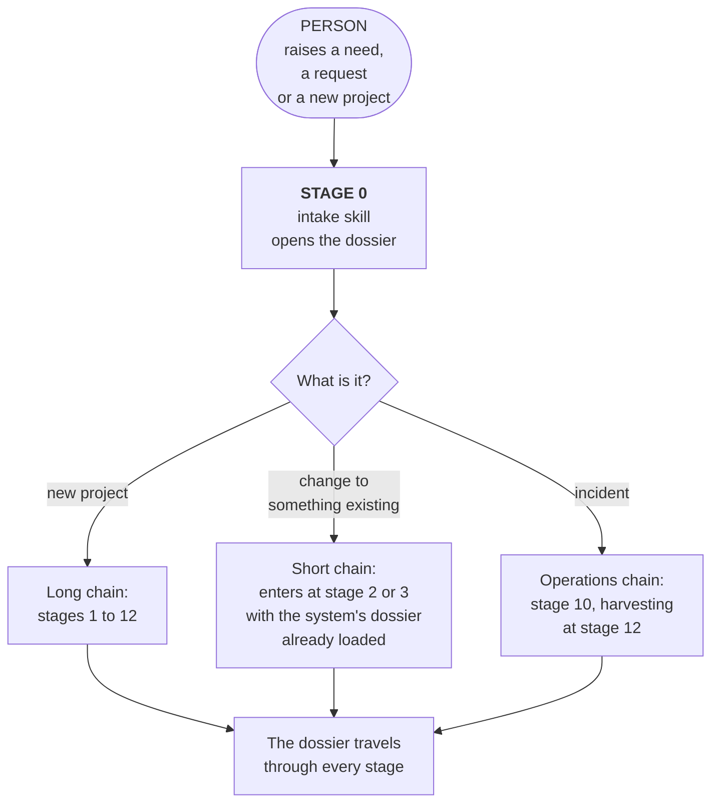
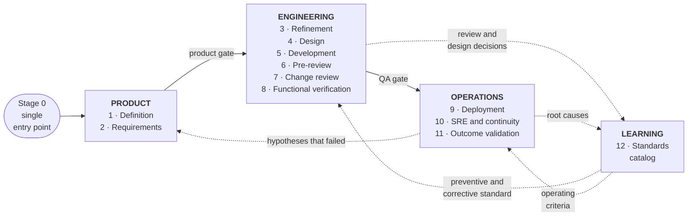
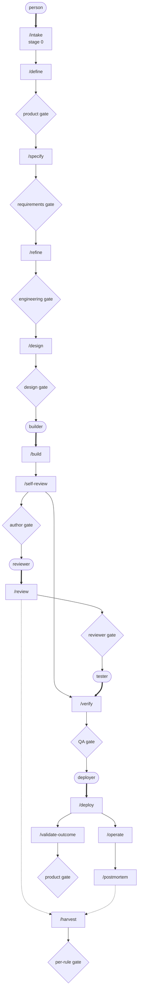
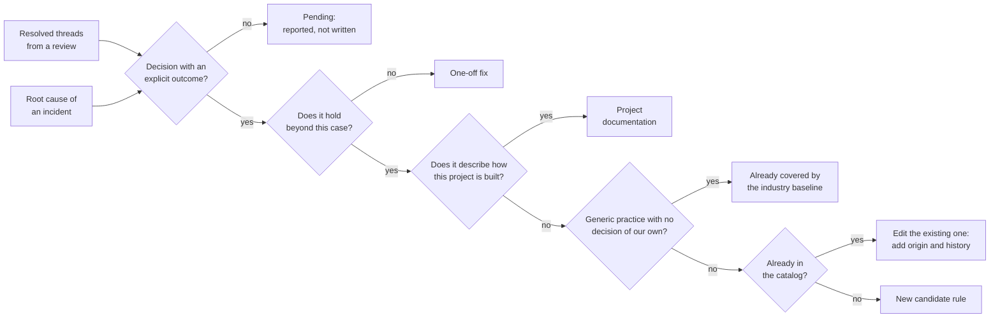

# GATE

### Governed, Assisted, Traceable Engineering

**An AI-assisted SDLC framework.** A software development life cycle that defines the stages,
their inputs and outputs, the human control points and the actors of each one.

Technical reference document, agnostic of company, domain, language and platform.

It covers the whole journey: from someone raising a need to the system running in production,
with the organisation having learned something from doing it.

Assistance that stops where judgement begins.

[TOC]

---

## 1. The thesis

Most teams already use AI assistants. Almost always the same way: each person with their own
prompt, in their own window, leaving no trace. The result shows within a few months.

Quality depends on who used the assistant that day and how well they asked. Decisions
evaporate, and the same debate comes back three weeks later in another change. Security and
compliance arrive once the code is written, which is the most expensive moment. And nothing is
auditable: there is no way to answer which standard was applied to a change, who approved it,
or since when it has been in force.

GATE adds no new capability to the assistant. It orders the ones it already has into stages
with an input, an output and an owner, with explicit points where a person decides, and with
mechanisms that turn every decision and every incident into a reusable standard.

The gain does not come from the assistant doing more. It comes from what it does sticking,
chaining into the next step, and not depending on someone remembering.

### What kind of framework this is, and what it does not replace

GATE is an **SDLC**: it describes the life cycle of a software product, from the need to
retirement, with the stages, artefacts and controls of each leg. It sits in the same family as
the classic life cycle models and as continuous integration and delivery practice.

What sets it apart is that **AI assistance is in the design of the cycle, not layered on top of
it**. In existing models the assistant is added as a tool each person uses at their own
discretion. Here every stage declares what the machine produces, what the person decides, and
what gets written down for the next stage.

**It does not replace how you organise the team.** Scrum, Kanban or whatever you use to
prioritise, plan and coordinate keeps working on top of GATE. This framework defines no
ceremonies, no cadence, no estimation, and no backlog shaping. It defines the journey of a
piece of work and who clears each step.

**It does not replace your engineering practices either.** Continuous integration, automated
testing, infrastructure as code and progressive delivery are inputs to stages 5 through 9, not
alternatives to them.

---

## 2. Stage 0: the single entry point

GATE has **one door**. A person raises a need, a request or a new project, and everything
else chains from there.

What the person hands over at stage 0 can be as informal as a transcribed voice note or a
forwarded email. What **cannot** be missing is who is asking and what for. The first stage
gathers everything else by asking.

### The dossier

Stage 0 produces a **dossier**: a single artefact that travels with the work through the whole
cycle, accumulating what each stage produces. It is what lets the stages chain without anyone
retyping the context.

| Stage that writes it | What it adds to the dossier |
|---|---|
| 0 · Entry | Who is asking, what for, and what type of work it is |
| 1 · Definition | Problem, context, constraints, data classification |
| 2 · Requirements | Functional and non-functional acceptance criteria, compliance requirements |
| 3 · Refinement | Affected components, risks with owners, test and observability plans |
| 4 · Design | Architecture decision, alternatives ruled out and why |
| 5 · Development | Proposed changes, instrumentation, tests |
| 6 · Pre-review | Findings resolved, functional verification script |
| 7 · Change review | Threads, decisions, published findings |
| 8 · Verification | Result per criterion |
| 9 · Deployment | Post-deployment check against the stage 2 criteria |
| 10 · Operations | Incidents, root causes, recovery drill results |
| 11 · Validation | Outcome measured against the stage 1 problem |
| 12 · Learning | Rules harvested, discards with their reason, pending decisions |

The dossier is also the audit record. It answers what was asked for, which standard was
applied, who approved each step, and on what evidence.

### What chains on its own and what does not

The chain advances by itself between stages. **It stops at every human gate**, without
exception.

A cycle that runs end to end without intervention is not this framework: it is a code factory
with no owner. The gates are the product, not the obstacle.

---

## 3. Principles

They apply to every stage. An implementation that breaks one stops being GATE.

**The assistant prepares, the person decides.** The assistant does the heavy lifting: reading,
correlating, drafting, checking. Every consequential decision belongs to a person, and is taken
on something already written down.

**Nothing runs unattended into shared systems.** Publishing a comment, opening a change,
writing in a ticket, touching an environment, silencing an alert. All of it is shown first and
executed on explicit approval, one at a time. Approving one thing does not authorise the rest.

**Verify before asserting.** No claim about how the system works rests on the assistant's
memory or on documentation that may be stale. It is checked against the code, the data or the
environment. If it could not be checked, that gets said.

**Every rule shows where it came from.** A standard with no link to the discussion or incident
that produced it is someone's opinion in the shape of a norm.

**Discards get recorded.** When someone rejects a finding, the reason is written down. Without
that the assistant raises it again and the team learns to ignore it, including the findings
that mattered.

**Missing dependencies get named.** If an access, a token or a data source is missing, say
which one and carry on with what you can, marking what was left uncovered.

**Check before creating.** Before opening a ticket, a change or a comment, check whether it
already exists. If it does, update it. Never a duplicate.

**Every stage delivers a verifiable artefact.** A stage whose output is "we agreed" did not
happen.

**The dossier is the only source of context.** What is not in the dossier does not exist for
the next stage. That forces the context to be written down instead of living in the head of
whoever was in the meeting.

---

## 4. The cycle

The dotted arrows are the learning loop. A decision taken today in a review, or a root cause
found today in an incident, becomes a standard that tomorrow applies on its own, before any
code is written.

That the catalog also feeds refinement is what stops the standard from being merely corrective.
A requirement that collides with a rule in force is caught before the first line.

---

## 5. The skills, named

Fourteen cycle skills and two cross-cutting ones. The names are GATE's proposal; what is not
negotiable is each one's contract: who triggers it, what it takes in, what it delivers, and
where it stops to ask.

Thick arrows come out of a person: those are the **five moments of human invocation**. Thin
ones are chained by the framework. Dotted ones feed learning. Diamonds stop the chain until
someone decides.

### Each skill's contract

| Skill | Stage | Triggered by | Delivers | Writes outside, on approval |
|---|---|---|---|---|
| `/intake` | 0 | **Person** | Dossier opened and classified by type of work | Ticket |
| `/define` | 1 | `/intake` | Problem, context, data classification | Ticket |
| `/specify` | 2 | `/define` | Acceptance and compliance criteria | Ticket |
| `/refine` | 3 | `/specify` | Components, risks with owners, test and observability plans | Subtasks |
| `/design` | 4 | `/refine` | Contrasted alternatives and a recorded decision | Decision record |
| `/build` | 5 | **Person** | The change, implemented, instrumented and tested | Repositories |
| `/self-review` | 6 | `/build` | Private findings, change proposal, QA script | Change and script |
| `/review` | 7 | **Person**, several times | Thread answers and its own findings | Comments, one by one |
| `/verify` | 8 | **Person**, with the `/self-review` script | Result per criterion | Nothing |
| `/deploy` | 9 | **Person** | Post-deployment check against the criteria | Production |
| `/operate` | 10 | Alert or person | Diagnosis grounded in sources | Alerts and incidents |
| `/postmortem` | 10 | Incident closure | Timeline and root cause | Document |
| `/validate-outcome` | 11 | `/deploy`, after the stage 2 window | Outcome against the original problem | Ticket |
| `/harvest` | 12 | `/review` and `/postmortem` | Candidate rules and three lists | Catalog, rule by rule |

Every skill declares explicitly **what it does not do**. An assistant with no written limits
invents them on the fly, and invents them differently every time.

### The five moments of human invocation

People start the chain at five points, and only five: when the need is born (`/intake`), when
someone sits down to build (`/build`), when someone reviews (`/review`), when someone tests
(`/verify`) and when someone deploys (`/deploy`). The framework chains everything else.

That matters because **mechanisms that depend on a person remembering to invoke them do not
happen**. The classic symptom is an empty standards catalog next to changes carrying hundreds
of discussion comments: nobody remembered to harvest.

### Cross-cutting skills

Two capabilities belong to no single stage and several stages consult them:

| Skill | What for | Consulted by |
|---|---|---|
| `/catalog` | Fetch the rules in force that apply by scope and project | `/refine`, `/design`, `/self-review`, `/review` |
| `/false-positive` | Record a finding the team rejected, and the reason | `/self-review`, `/review` |

---

## 6. The actors

### The line between the AI and the people

The whole framework rests on a split that admits no exceptions.

**The AI produces and verifies. The person judges and authorises.**

Four things the AI always does, at every stage:

1. Read and correlate whatever is needed, without tiring or skipping parts.
2. Draft every artefact, so nobody starts from a blank page.
3. Check against the source rather than against its memory, and say when it could not check.
4. Chain the next stage carrying the dossier, so context is never retyped.

Four things a person always does, and the AI never:

1. **Accept or reject at a gate.**
2. **Choose between alternatives when something has to be given up.** A trade-off between cost,
   time and scope is a business decision, not a calculation.
3. **Authorise any write into a shared system.**
4. **Answer for the outcome.** Responsibility is not delegated to a tool, and an organisation
   that tries finds out at the first audit.

When one of the four on the right moves to the left, the framework stops applying, however
unchanged everything else looks.

### The eight roles

Roles, not job titles. One person can hold several.

| Role | What they clear | Profile |
|---|---|---|
| **Requester** | Nothing. They raise the need | Knows the problem first hand. Needs no technical profile |
| **Product owner** | Gates 1, 2 and 11 | Decides what gets built and what does not. Can take being told their hypothesis failed |
| **Engineering lead** | Gates 3 and 4 | Architecture judgement and memory of the system. Able to reject a well-written proposal |
| **Builder** | Gate 6, over their own work | Implements. Can read what the AI proposes and spot when it is wrong |
| **Reviewer** | Gate 7 | Someone other than the builder. Exercises judgement rather than re-reading what the AI said |
| **Verifier** | Gate 8 | Tests against the criteria. Can be another builder on the team |
| **Operations owner** | Gate 9 and any action on production | Keeps the service up. Decides on rollback |
| **Standard custodian** | Gate 12 | Approves rules. For hard rules, the whole team |

### The three incompatibilities

One name can hold several roles, except in three cases. These are what keep judgement
independent when the team is small.

**Whoever builds does not review that same change.** This is the separation that stops the
assistant from ending up as the only reviewer.

**Whoever proposes a design decision does not accept it.** A single alternative presented
without contrast, approved by the person who wrote it, is a decision nobody took.

**Whoever builds does not validate the business outcome.** Nobody judges their own work well.

### Who takes part in each stage

| Stage | The AI does | The person does | Who |
|---|---|---|---|
| 0 · Entry | Classifies the work, opens the dossier | Raises the need | Requester |
| 1 · Definition | Drafts the problem, flags ambiguity, classifies data | Accepts the statement | Product |
| 2 · Requirements | Proposes criteria, demands numbers on the non-functional ones | Accepts the criteria | Product and engineering |
| 3 · Refinement | Maps components by reading the code, raises risks | Assigns an owner to each risk, accepts the breakdown | Engineering |
| 4 · Design | Puts forward contrasted alternatives and their consequences | Picks one and answers for it | Engineering, not the builder |
| 5 · Development | Implements, instruments, writes tests | Directs and corrects | Builder |
| 6 · Pre-review | Reviews in private, drafts the proposal and QA script | Approves each publication | Builder |
| 7 · Change review | Answers threads, raises findings, harvests | Confirms each finding before it is published | Reviewer |
| 8 · Verification | Drafts the script | Runs it and records results | Verifier |
| 9 · Deployment | Compares against criteria, proposes rollback | Authorises every action on production | Operations |
| 10 · Operations | Diagnoses with evidence, drafts the postmortem | Decides what gets touched and what gets alerted | Operations |
| 11 · Validation | Measures the outcome against the original problem | Decides to close, iterate or roll back | Product |
| 12 · Learning | Drafts the candidate rule with its origin | Confirms it is a team decision | Custodian |

### How many people

Thirteen stages and eight roles do not mean thirteen people. Roles concentrate, and the three
incompatibilities are what set the floor.

**Viable minimum: three people.** One in product, and two engineers who alternate: when one
builds, the other reviews, and the other way round. That satisfies all three
incompatibilities. Either engineer can carry operations.

**Recommended: four or five.** Add someone dedicated to operations, the role that survives
part-time worst because incidents do not wait. And separate the requester from product, so the
person asking is not the person approving.

**Practical ceiling: seven.** Above that the gates start queuing and the cycle stalls waiting
for approvals. When a product needs more people, split it into two cycles with separate
dossiers rather than fattening one.

A traditional cycle covering the same ground usually spreads these eight roles across eight or
ten people, with a context handover at every step. The reduction does not come from anyone
working more: it comes from context travelling in the dossier instead of being rebuilt in
every handover meeting.

### A warning about small teams

Fewer people means fewer independent viewpoints. A small team with strong assistance converges
fast, and can converge with great confidence on the wrong answer, because the assistant writes
the wrong thing as fluently as the right one.

The three incompatibilities exist for exactly that. A team that cuts headcount and also relaxes
them is not applying GATE: it is automating its own bias, faster than before.

---

## 7. The stages

### Stage 1 · Definition

Turns a need in business language into a statement an engineering team can assess. Product runs
it.

The assistant drafts the statement separating the observed problem from the solution someone
already imagined: most requests arrive with a solution inside and without the problem that
motivated it. It flags ambiguity instead of resolving it, returning both possible readings. It
classifies the data involved — personal, health, financial, regulated — and that classification
travels with the dossier to production, setting the depth of every later stage. And it looks
for precedent: earlier tickets, decisions already taken, related incidents, catalog rules that
apply.

**Gate.** Product accepts. Nothing moves on without a data classification.

### Stage 2 · Requirements

Settles what done means, in terms that can be checked.

The assistant proposes acceptance criteria that can be verified, and demands numbers on the
non-functional ones: response time, expected volume, required availability, tolerable recovery
window. Without a number they cannot be verified in stage 8 or watched in stage 10. It derives
the compliance requirements that follow from the data classification: retention, audit,
encryption, minimisation, data subject rights. And it points out which criteria will need
instrumentation, so stage 3 accounts for it.

**Gate.** A non-functional criterion without a number goes back.

### Stage 3 · Refinement

Turns requirements into executable work, with the risks on the table before any code.

The assistant breaks the work into tasks with verifiable outputs, and maps the affected
components **by reading the actual code**: a map drawn from memory or from an old diagram is
wrong precisely about the systems that changed the most. It raises security and compliance
risks grounded in the data classification and the hard rules in force. It detects when a
requirement collides with a rule in force and raises it as a product decision. It proposes the
test plan and the **observability plan**: whatever is not instrumented here does not exist in
stage 10.

**Gate.** A risk without an owner blocks the move to development.

### Stage 4 · Design

Settles the architecture decision before any code, and puts it on the record.

This is where assistance pays off most and carries most risk: the assistant proposes a solution
as fluently whether it is well founded or not. That is why the decision is recorded, not just
the result.

It puts forward **at least two workable alternatives** with their consequences, rather than
presenting one as if it were the only option. It names what each alternative closes off for the
future, which usually weighs more than its cost today. It checks each one against the rules in
force and against the patterns the project already holds. And it writes a short decision
record: what was decided, what was ruled out and why, and what would have to change to revisit
it.

**Gate.** Someone who did not draft the proposal accepts the decision. A single alternative
presented without contrast goes back.

This record is one of the best sources for stage 12: a design decision already arrives argued
and contrasted, which is exactly what a rule usually lacks.

### Stage 5 · Development

Implement, leaving the trail the later stages need. The assistant consults the catalog before
proposing a pattern, instruments what the plan called for in the same change rather than
afterwards, and writes the tests alongside the code.

### Stage 6 · Pre-review

First of the two reviews. It is **private**: its output goes to the author. It exists so the
change reaches human review already cleaned up.

It identifies the ticket from the branch and pulls its definition without editing it. It
determines every repository the change touches and checks none was left half done. It runs
linters and static analysis. It checks every claim about conventions against the actual code.
It runs a full hard-rule pass if the change touches authentication, authorisation, tenant
isolation or sensitive data. It cross-checks the artefacts that travel together: migrations
with their changelog entry, instrumentation with the plan, documentation with the code. It
compares **the whole branch against the base**, not just the latest commits, against the
criteria from stage 2. And it drafts the change proposal and the functional verification
script.

**Gate.** The author approves every output into a shared system, one at a time.

### Stage 7 · Change review

Someone other than the author validates the change, with support. **It runs several times**
while the review lasts: a single pass when the change opens arrives before the decisions exist.

It reads the threads across every change in the ticket and splits them into open ones, which
need answering, and **resolved** ones, which are the input for stage 12. It checks every
suggestion from another reviewer against the actual code before backing it or pushing back. It
raises findings with severity, file and line, and with the rule id when the finding comes from
the catalog: without that id nobody can go and argue with the rule, and arguing with it is how
the standard improves. It consults the false-positive record before raising something already
rejected.

**Gate.** Every finding is presented with an explicit counterfactual question — whether it
really applies here or is a false positive — and is published only on confirmation.

> **Why two reviews and not one.** The pre-review is private and exists so the author can fix
> things at no social cost. The change review is public and exists so another person exercises
> judgement. Merging them turns the assistant into the reviewer, which is exactly what this
> framework avoids.

### Stage 8 · Functional verification

Check against the criteria from stage 2, on the running system. The assistant drafts the
script; it neither runs it nor signs it off.

A good script does six things: one checkbox per **verifiable result** rather than per case, so
a failure points at what failed; one block per affected component, naming what to look at on
each screen; the precondition written as a check the tester can perform, with what to do if it
is not met; steps executable with the tools they already have; known false alarms stated up
front; and what to do with whatever cannot be tested in that environment, which is to leave it
unchecked and note it, never mark it failed.

**Gate.** A stage 2 criterion left unverified blocks deployment.

### Stage 9 · Deployment and post-deployment check

Put the change in production and check with data that it behaves the way the criteria said.

The assistant gathers the manual steps the deployment requires instead of letting them surface
during the window. It compares observed behaviour against the non-functional criteria from
stage 2 using the data sources from stage 10: that comparison is why those criteria had to
carry a number. It watches the window afterwards for deviations from the previous baseline,
not from an invented threshold. On detecting a deviation it presents the evidence and
**proposes** a rollback; the decision is human.

**Precondition.** A rollback procedure that has been exercised, not merely documented.

### Stage 10 · Operations, SRE and continuity

Keep the service up, detect before the user does, and recover inside the committed window.

#### The data sources

An assistant with no access to operational data offers opinions. With access, it diagnoses.

| Source | What it answers | Common mistake |
|---|---|---|
| Application logs | What the system did and with what error | Taking an intermediary's log as if it were the origin's |
| Metrics | How much and how fast, over time | Watching averages and losing the high percentiles, where the problem lives |
| Distributed traces | Where a request went and where the time went | Not propagating the correlation id and losing the chain |
| Infrastructure logs | What the platform did underneath the service | Blaming the application for node rotation or network |
| Audit trail | Who did what, when, over which data | Mixing it with application logs and losing its evidential value |
| External dependency status | Whether the problem is ours or inherited | Diagnosing inward a failure that belonged to a third party |

Three conditions make them useful. A **correlation id propagated end to end**, without which
each source tells a different story. **One source of truth per question**: when two dashboards
answer the same question with different numbers, the team stops believing both. And **declared,
sufficient retention**, which follows from the compliance requirements of stage 2, because an
incident investigated three days later needs data from three days ago.

#### What the assistance does

It correlates the sources from a symptom and separates cause from noise, grounding every claim
in the source that can prove it. It compares current behaviour against the baseline before the
last change and links it to the ticket that introduced it. It proposes what deserves an alert
and, above all, what does not: if nobody will do anything differently when it fires, it is a
dashboard number. It drafts the postmortem with the timeline rebuilt from the sources, not
from the memory of whoever was on call. And it prepares the recovery drill script, comparing
the real result against the committed window.

#### Securing operations

Five conditions. None is exotic and almost none is met in full.

**A rollback that has been exercised.** A procedure never run is a hypothesis.

**Recovery windows with a number and a drill.** How long you tolerate being down and how much
data you tolerate losing, declared in stage 2 and measured in a real drill.

**External dependencies with defined degradation.** What the system does when a third party
does not answer. Without that definition, the default answer is to pass the failure to the
user.

**Blast radius isolation.** That one component failing does not drag the rest. Proven by
causing it in a controlled environment.

**Audited emergency access.** With a trail and an expiry. Permanent emergency access is normal
access under a misleading name.

### Stage 11 · Outcome validation

Go back and ask whether the problem from stage 1 was solved.

This is the stage almost no cycle has, and its absence is why organisations measure what they
shipped rather than what worked. Stages 8 and 9 check that the system does what the criteria
said. Neither checks that this solved anything.

It runs once the change has been in production long enough to have data, and that window is
set in stage 2 alongside the criteria.

The assistant compares observed behaviour in production against the problem stated in stage 1,
using the data sources from stage 10 and whatever business indicators apply. It distinguishes
three outcomes and names them without softening: the problem was solved, it was half solved and
here is what was left out, or it was not solved and the stage 1 hypothesis was wrong.

**Gate.** Product accepts the outcome and decides: close, iterate, or roll the feature back.

This is the framework's **second learning loop**. The stage 12 loop improves how things get
built; this one improves what gets decided. A product hypothesis that failed is as valuable as
a root cause, and is lost just as easily.

### Stage 12 · Learning

Make what was learned outlive the conversation or the shift where it appeared. **Two sources,
one destination.**

An incident is as good a source of rules as a discussion, and usually yields better ones:
nobody argues with a root cause that already cost an outage.

**Gate.** Every rule is presented with a counterfactual question — whether it is a team
decision or the assistant's general opinion with a link stapled to it.

**Output.** Candidate rules and a report with three lists, delivered every time even when the
first is empty: harvested, discarded with the reason, and pending decisions.

A rule is born **with no blocking power**. Acquiring it is an explicit human decision, and for
security rules, the whole team's. That stops the assistant from imposing standards nobody
agreed to.

### Optional stage · Retirement

Switching off a system or a feature carries obligations almost no cycle covers, and it is where
compliance risk piles up quietly.

What has to be settled: which data must be kept and for how long, which must be deleted and
with what evidence, which integrations depend on what is being switched off, and who owns the
historical archive afterwards. The data classification from stage 1 says what applies.

Adopt it when the organisation actually retires systems. One that never switches anything off
does not need the stage, and usually has the problem of never switching anything off.

---

## 8. Effect on the organisation

### Where the time goes today

In a traditional cycle with no or limited AI support, much of the effort is not spent deciding.
It is spent producing and carrying artefacts: drafting the ticket, explaining the context again
at refinement, reading the whole change to review it, writing the test script, rebuilding an
incident timeline by hand, and drafting the postmortem nobody will reread.

That work is necessary and it is mechanical. It is exactly where assistance pays.

### What changes with GATE

Mechanical work collapses and **the bottleneck moves to judgement**. What used to take an
afternoon of drafting becomes a review of something already drafted. The gates stop being
paperwork and become the work.

That has three consequences worth stating plainly.

**The same team covers more ground.** Not because anyone works more, but because they stop
producing intermediate artefacts by hand.

**Roles consolidate.** The line between whoever refines and whoever builds, or between whoever
operates and whoever diagnoses, blurs once context travels in the dossier instead of in
someone's head. A smaller team can sustain a product that used to demand several separate
roles.

**The cost of a bad decision rises.** When the assistant produces in minutes what used to take
days, a wrong call propagates just as fast. That is why the gates are mandatory and why the two
reviews are kept apart.

### The warning

Cutting headcount is a possible consequence, not a goal of the framework, and it carries a
concrete risk: fewer people means fewer independent viewpoints.

A small team with strong assistance can converge quickly on the wrong answer, and converge
confidently, because the assistant writes the wrong thing as fluently as the right one.

The countermeasure is in the design: that pre-review and change review are never the same
person, that the product and engineering gates are held by someone who did not write what is
being approved, and that no rule reaches blocking status without the team's approval. A team
that cuts people and also relaxes those three points is not applying GATE: it is automating
its own bias.

---

## 9. What improves, and how to check it

Without indicators, this is a well-written opinion.

**Productivity.** Time between a change being ready and entering review. Time to diagnose an
incident.

**Quality.** The share of findings that surface in pre-review versus those that reach human
review. If the second number does not fall over time, the cycle is not learning.

**Security.** How many security findings are caught before any code is written.

**Compliance.** That for any change in production you can answer which standard was applied,
with which rule, at which version, approved by whom. A versioned catalog answers that; a
conversation with an assistant does not.

**Continuity.** Recovery drill results against the committed window. The share of incidents
detected by your own instrumentation before a user reports them.

**Learning.** How many rules entered the catalog per quarter, and how many repeated discussions
stopped happening. A catalog that does not grow means stage 12 is not running, whatever the
other eleven say.

---

## 10. Preconditions

- Personal credentials per person, never shared. A team token destroys the traceability of who
  approved what.
- A local copy of every repository the cycle touches, including the standards one.
- A catalog readable by machine, versioned, with a format validator.
- A low-friction place to record false positives, outside the rule approval process. If
  recording a false positive cost an approval, nobody would record one.
- A branch convention that links to the ticket, so traceability resolves without asking.
- A correlation id propagated end to end, and a declared retention period.
- A place for the dossier to live, readable by people and by machine.

---

## 11. Adoption

In this order. Each step works without the ones after it, and none requires the previous one to
be perfect.

1. **The standards catalog, empty.** With a rule format, a validator and a generated catalog.
   Empty on purpose: a set copied from an industry guide describes whoever copied it.
2. **The pre-review.** It returns the most for what it costs and forces nobody else to change
   how they work.
3. **The change review, with harvesting inside it.** Both together. An assisted review that
   does not harvest leaves the cycle open.
4. **The functional verification script.** Cheap, and it draws a clear line between review and
   QA.
5. **Refinement and design.** Once the catalog holds rules worth consulting before settling an
   architecture.
6. **Operations and SRE.** Requires the data sources to exist and be trustworthy, usually the
   longest work of all.
7. **Stage 0, definition and requirements.** They depend on product picking up the habit, and
   that cannot be decreed.
8. **Outcome validation.** Last, because it needs trustworthy business data and the willingness
   to record that a hypothesis failed.

The framework pays from step 2. There is no need to wait for the whole thing.

---

## 12. Anti-patterns

**The assistant that acts on its own.** Publishes, opens changes or touches environments
without approval. One visible mistake is enough for the team to lose trust and go back to doing
everything by hand.

**The chain with no gates.** A cycle that runs end to end without human intervention produces
code with no owner, and nobody can answer why it was done that way.

**The catalog filled in one sitting.** Fifty rules copied from a generic guide. Nobody
recognises them as their own and the team learns to ignore the findings.

**Manual harvesting.** A command someone should run when they remember. It does not happen.

**The single-pass review.** Decisions appear when threads get resolved, and by then nobody is
looking.

**The silent discard.** Rejecting a finding without recording the reason.

**The rule with no origin.** A norm nobody can trace gets re-argued every time it appears.

**Observability as a later task.** The first incident is diagnosed blind.

**The alert nobody acts on.** It trains the team to ignore the whole channel.

**The non-functional criterion with no number.** It cannot be verified in QA or watched in
production, so in practice nothing was required.

**The assistant opining on production without data.** A diagnosis with no sources is a
well-written guess, which is worse than none.

**The abandoned dossier.** If one stage stops writing to it, the next one asks again what was
already answered, and the chain breaks without anyone noticing.

---

## About the name

**GATE** — Governed, Assisted, Traceable Engineering.

Four words, each carrying its own weight. *Governed*: a person clears every control point.
*Assisted*: the machine does the reading, the correlating and the drafting. *Traceable*: the
dossier answers what was asked, what standard was applied and who approved it. *Engineering*:
the scope is building and running software, not organising the team.

The word itself is the thesis. While most of the field is selling autonomous agents, this
framework sells the places where the work stops and a person decides.

Every gate in it exists because something, somewhere, once went through without one.
